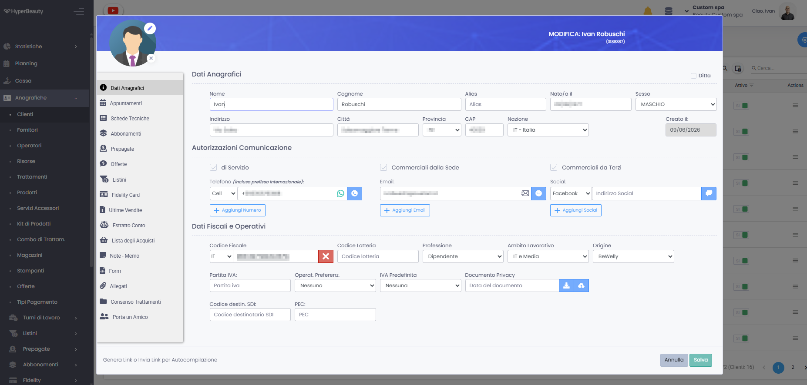

# Contesto di Mercato

## Il settore beauty in Italia

Il mercato dei saloni di bellezza e dei centri estetici in Italia conta **oltre 102.000 imprese attive** (fonte: iCRIBIS, marzo 2026 — codice ATECO 96.21). I numeri chiave del settore:

| Dato | Valore |
|------|--------|
| Imprese attive (ATECO 96.21) | **oltre 102.000** |
| Fatturato settore | **653 milioni € (+5,7% vs 2023)** |
| Incidenza microimprese | **99,5%** |
| Attività con meno di 2 dipendenti | **55%** |
| Attività con 4 o più dipendenti | **11%** |
| Addetti totali nel settore | **~46.000** |
| Profilo di rischio inferiore alla media retail | **75%** |

La stragrande maggioranza sono **micro-imprese** a gestione familiare, con il titolare che spesso è anche operatore. Questo si traduce in decisioni rapide, interlocutore unico e forte preferenza per soluzioni semplici, scalabili e con costi prevedibili. Un mercato **ampio, capillare e a basso rischio commerciale** — i potenziali clienti sono già presenti e operativi nel vostro territorio.

---

## Come gestiscono il business oggi

La realtà che troverete visitando un salone medio italiano:

### 📋 L'agenda
Ancora spesso **cartacea** o su Google Calendar personale. Le doppie prenotazioni sono frequenti. Quando il titolare è in ferie, nessuno sa dove trovare gli appuntamenti.

### 📱 Le prenotazioni
Arrivano su **WhatsApp personale** del titolare o degli operatori, a qualsiasi ora. Il titolare risponde tra un cliente e l'altro, spesso in ritardo. I clienti si lamentano, qualcuno va dalla concorrenza.

### 💰 Gli incassi
Registrati su foglio Excel, su un quaderno o nella memoria. Nessuna visibilità su quali servizi rendono di più, quali operatori sono più produttivi, quali clienti spendono di più.

### 👥 I clienti
Non c'è una vera scheda cliente. Si ricordano "a memoria" le preferenze. Se cambia l'operatore, le informazioni si perdono. Non c'è nessun sistema per ricontattare i clienti inattivi.

### 📦 Il magazzino
I prodotti finiscono senza preavviso. Gli acquisti vengono fatti "a occhio". Non si sa mai con precisione quanto si spende in prodotti rispetto a quanto si incassa.

---

## Il problema che HyperBeauty risolve

Ogni problema quotidiano di un centro beauty ha un costo reale:

| Problema | Costo reale stimato |
|----------|---------------------|
| 3 no-show a settimana (servizio medio €30) | **€360/mese persi** |
| 1 ora/giorno su WhatsApp e agenda manuale | **~20 ore/mese sprecate** |
| Nessun sistema di rientro clienti inattivi | **20-30% clienti persi ogni anno** |
| Magazzino non tracciato | **5-10% prodotti sprecati o rubati** |
| Nessuna fidelizzazione strutturata | **Bassa ricorrenza, alta volatilità** |

> **La domanda chiave da porre al cliente:**
> *"Quanti no-show hai ogni settimana? E quante ore passi a rispondere su WhatsApp invece di lavorare?"*

Quando il titolare fa i conti, spesso si accorge che il gestionale si **ripaga da solo nel primo mese**.

---

## La digitalizzazione nel beauty: dove siamo

Il settore beauty è storicamente uno degli ultimi a digitalizzarsi, ma il cambiamento è in atto:

### Cosa chiedono i clienti finali oggi
- **Prenotare online** senza dover chiamare, a qualsiasi ora
- **Ricevere promemoria** prima dell'appuntamento
- **Accedere alla propria storia** di trattamenti
- **Pagare in modo flessibile** (abbonamenti, prepagate, carte)

### Cosa stanno facendo i concorrenti
I saloni che si sono già digitalizzati stanno crescendo più velocemente. Acquisiscono clienti tramite Google, Instagram e app di prenotazione. Chi non si adegua perde visibilità e clienti, specialmente tra i più giovani.

### Il ruolo crescente delle normative
- **Privacy e GDPR** impongono gestione strutturata dei dati clienti
- **Registratori telematici** già obbligatori: HyperBeauty si integra nativamente con le stampanti Custom (solo dispositivi con protocollo WebService)
- **Fatturazione elettronica**: nel settore beauty l'utilizzo è ancora molto limitato. HyperBeauty genera il file solo ai fini della trasmissione telematica, non ci sono movimenti di magazzino o altro.

---

## I competitor nel software gestionale beauty

Il mercato italiano ha diversi player specializzati. Conoscerli vi aiuta a posizionare meglio HyperBeauty:

### Software gestionali verticali beauty

| Software | Profilo | Punti di forza | Punti deboli vs HyperBeauty |
|----------|---------|---------------|----------------------------|
| **Panema Pagest** | Cloud, sede Lugano + filiale italiana. Oltre 7.000 saloni in Europa e Svizzera | POS integrato Buffetti Finance, WhatsApp Business integrato, microcamera professionale Mic-Fi per analisi cute/capelli, forte espansione internazionale | Referente tecnico primario svizzero, nessuna integrazione nativa con hardware Custom |
| **BeautyCheck** (Info-lan srl, Pandino CR) | Cloud, 20 anni di esperienza, oltre 4.000 centri in Italia. ISO 9001 certificata | Storia e credibilità consolidate nel settore, app clienti personalizzata brandizzata, assistenza telefonica umana fino alle 19 (anche sabato), target ampio (estetici, parrucchieri, SPA, studi medici) | Nessuna integrazione nativa con hardware Custom, interfaccia meno moderna rispetto ai nuovi entrant |
| **Magnolia Pro** (Magnolia Tech Srl, Milano) | Cloud SaaS, oltre 100 partner attivi. Prova gratuita 30 giorni | Interfaccia moderna e intuitiva, commissioni staff personalizzabili, cassa fiscale RT integrata, gestione timbrature collaboratori | Base clienti ancora limitata, nessuna integrazione hardware Custom, meno radicato sul territorio |

### Piattaforme di marketplace e prenotazione

| Software | Profilo | Punti di forza | Punti deboli vs HyperBeauty |
|----------|---------|---------------|----------------------------|
| **Treatwell** | Marketplace europeo di prenotazioni | Grande visibilità, bacino di utenti consumer ampio | Commissioni su ogni prenotazione, dipendenza dalla piattaforma, nessun controllo sui dati cliente |

### Software gestionali generalisti con presenza nel beauty

| Software | Profilo | Punti di forza | Punti deboli vs HyperBeauty |
|----------|---------|---------------|----------------------------|
| **Venere** | Brand noto, base installata consolidata | Ecosistema contabile integrato, rete rivenditori strutturata | Struttura legacy, meno flessibile su mobile, non specializzato beauty, nessun hardware Custom |
| **Dylog-Buffetti** (vendita diretta e tramite partner) | Rete distributiva capillare, presente anche tramite rivenditori locali | Ecosistema contabile-fiscale integrato, capillarità territoriale | Non specializzato beauty, interfaccia generica, nessun hardware Custom |

!!! info "Il vantaggio competitivo chiave"
    HyperBeauty è l'**unico gestionale beauty integrato nativamente con l'hardware Custom** (dispositivi WebService). Per voi Partners è un argomento esclusivo che nessuno dei competitor sopra può replicare: chi acquista la stampante Custom e il gestionale HyperBeauty ha un ecosistema unico, un solo interlocutore, meno problemi tecnici.

---

## I segnali che un cliente è pronto ad acquistare

Durante la visita commerciale, questi sono i segnali che indicano un cliente caldo:

- ✅ Si lamenta dei no-show frequenti
- ✅ Gestisce tutto su WhatsApp e dice di essere sommerso di messaggi
- ✅ Ha già una stampante Custom o sta valutando di acquistarla
- ✅ Ha clienti fidelizzati ma nessun sistema strutturato per mantenerli
- ✅ Ha più operatori e fatica a coordinare i turni
- ✅ Vuole aprire la prenotazione online ma non sa da dove iniziare
- ✅ Ha già provato un gestionale ma lo ha abbandonato perché "troppo complicato"

---

## Il ruolo del Partner

Voi non vendete solo un software. Portate a un professionista uno **strumento che cambia il modo di lavorare** e libera tempo prezioso. Questo è il valore da comunicare fin dal primo contatto.

La vostra forza rispetto alla vendita diretta online:

- **Siete presenti fisicamente** sul territorio — costruite fiducia
- **Conoscete già il cliente** — spesso è già vostro cliente per l'hardware
- **Fate il setup** — il titolare non deve fare nulla da solo
- **Siete il supporto locale** — non un numero verde anonimo

!!! tip "Messaggio chiave"
    Non vendere funzionalità. Vendi **tempo risparmiato**, **clienti fidelizzati** e **controllo del business**. Il software è il mezzo, non il fine.

---

[Successivo: Il Prodotto HyperBeauty](prodotto.md)
